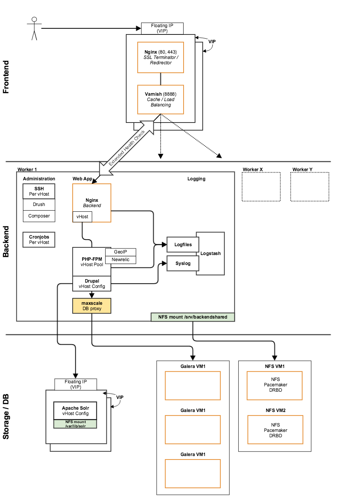

# Cluster

The biggest and most reliable setup you can host your site on is our Cluster Stack. It consists of several servers and is designed for high reliability and can serve high traffic sites with ease. If we see that we need to scale we can scale every component indiviudally to optimize the infrastructure to the current traffic levels.

### Frontend Server
* **Frontend Nginx  **
The frontend Nginx server takes care of SSL Termination and Redirects
* **Varnish**  
Content which can be cached is cached in memory by Varnish

### Backend servers
This is where Drupal is running

* **Backend Nginx**
* **PHP-FPM**

###Database
* **Database MariaDB**

###Caching / Search:
* **In-Memory cache Redis**
* **Search Apache Solr**

###Filestorage
* **NFS File Server**
