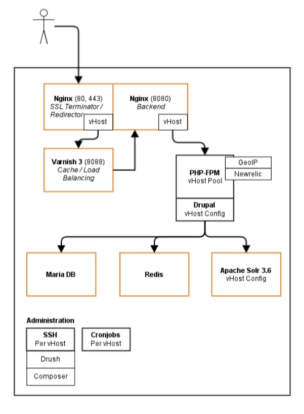

# Compact

The compact stack is tailored for single-server environments and contains all Services on one server.

All services are running on the same server:

* Nginx (Frontend and Backend)
* Varnish  
* PHP-FPM
* Database MariaDB
* In-Memory cache Redis
* Search Apache Solr
