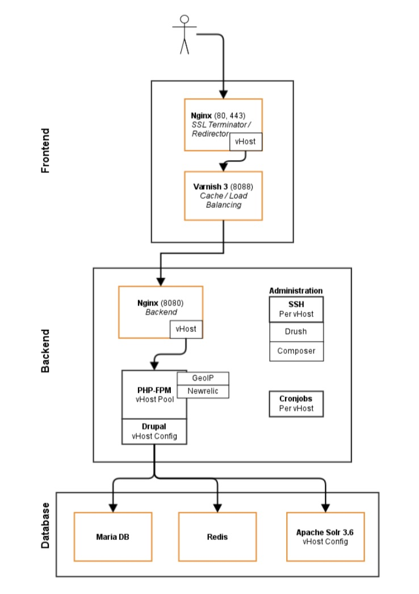

# Single

Our Single Stack consists of 3 Servers. This setup enables us to use specialized hardware configurations for certain workloads. For example the Database server can be tailored to use SSD storage and have more Memory than the internet facing servers.

### Frontend Server
* **Frontend Nginx**  
The frontend Nginx server takes care of SSL termination and redirects
* **Varnish**  
Content which can be cached is cached in memory by Varnish

### Backend Server

* **Backend Nginx**
The second Nginx instance takes care of running the actual drupal site. PHP requests are passed to PHP-FPM.
* **PHP-FPM**

###Database / Caching / Search:
* **Database MariaDB**
* **In-Memory cache Redis**
* **Search Apache Solr**
